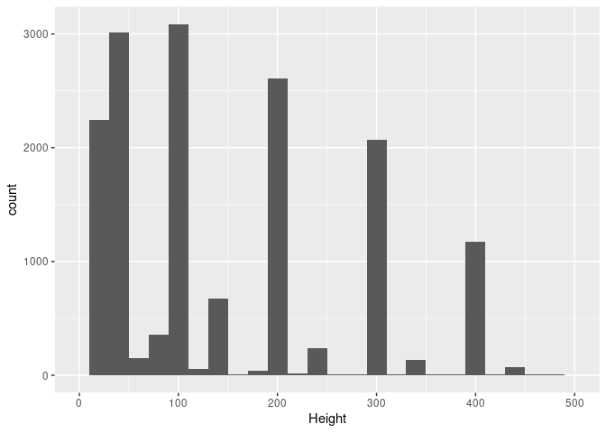

Airplane-wildlife Strikes Analysis
================
Pongsatorn Konggate
2024-01-02

# Introduction

This is a project for Google Data Analytics course by Coursera. Which
will mostly use the steps of the data analysis process: ask, prepare,
process, analyze, share, act for this analysis.

## Task to investigate

- **Trend of airplane and wildlife collision and how to reduce
  incidents.**

## Data

- **Data Source**: This dataset is from kaggle’s [Aircraft Wildlife
  Strikes,
  1990-2015](https://www.kaggle.com/datasets/faa/wildlife-strikes) under
  [CC0 license](https://creativecommons.org/publicdomain/zero/1.0/).
  With the original data source from [FAA Wildlife Stirke
  Database](https://wildlife.faa.gov/home) which contains records of
  voluntary reported wildlife strikes.

## Data cleaning, manipulation and analysis

- We are using SQL to preprocess data in this following steps
- Looking at Schema to learn about data type and detail of data of each
  fields to familiarize with data.
- Sorting and filtering for interested data into seperate table.

``` r
library(tidyverse)
```

    ## ── Attaching core tidyverse packages ──────────────────────── tidyverse 2.0.0 ──
    ## ✔ dplyr     1.1.4     ✔ readr     2.1.4
    ## ✔ forcats   1.0.0     ✔ stringr   1.5.1
    ## ✔ ggplot2   3.4.4     ✔ tibble    3.2.1
    ## ✔ lubridate 1.9.3     ✔ tidyr     1.3.0
    ## ✔ purrr     1.0.2     
    ## ── Conflicts ────────────────────────────────────────── tidyverse_conflicts() ──
    ## ✖ dplyr::filter() masks stats::filter()
    ## ✖ dplyr::lag()    masks stats::lag()
    ## ℹ Use the conflicted package (<http://conflicted.r-lib.org/>) to force all conflicts to become errors

``` r
library(reshape)
```

    ## 
    ## Attaching package: 'reshape'
    ## 
    ## The following object is masked from 'package:lubridate':
    ## 
    ##     stamp
    ## 
    ## The following object is masked from 'package:dplyr':
    ## 
    ##     rename
    ## 
    ## The following objects are masked from 'package:tidyr':
    ## 
    ##     expand, smiths

``` r
library(RColorBrewer)
library(plyr)
```

    ## ------------------------------------------------------------------------------
    ## You have loaded plyr after dplyr - this is likely to cause problems.
    ## If you need functions from both plyr and dplyr, please load plyr first, then dplyr:
    ## library(plyr); library(dplyr)
    ## ------------------------------------------------------------------------------
    ## 
    ## Attaching package: 'plyr'
    ## 
    ## The following objects are masked from 'package:reshape':
    ## 
    ##     rename, round_any
    ## 
    ## The following objects are masked from 'package:dplyr':
    ## 
    ##     arrange, count, desc, failwith, id, mutate, rename, summarise,
    ##     summarize
    ## 
    ## The following object is masked from 'package:purrr':
    ## 
    ##     compact

``` r
df_database <- data.frame(read_csv("database.csv"))
```

    ## Warning: One or more parsing issues, call `problems()` on your data frame for details,
    ## e.g.:
    ##   dat <- vroom(...)
    ##   problems(dat)

    ## Rows: 174104 Columns: 66
    ## ── Column specification ────────────────────────────────────────────────────────
    ## Delimiter: ","
    ## chr (18): Operator ID, Operator, Aircraft, Aircraft Type, Aircraft Make, Eng...
    ## dbl (48): Record ID, Incident Year, Incident Month, Incident Day, Aircraft M...
    ## 
    ## ℹ Use `spec()` to retrieve the full column specification for this data.
    ## ℹ Specify the column types or set `show_col_types = FALSE` to quiet this message.

``` r
dim(df_database)
```

    ## [1] 174104     66

``` r
summary(df_database)
```

    ##    Record.ID      Incident.Year  Incident.Month    Incident.Day  
    ##  Min.   :  1000   Min.   :1990   Min.   : 1.000   Min.   : 1.00  
    ##  1st Qu.:205412   1st Qu.:2001   1st Qu.: 5.000   1st Qu.: 8.00  
    ##  Median :249103   Median :2007   Median : 8.000   Median :16.00  
    ##  Mean   :241204   Mean   :2006   Mean   : 7.172   Mean   :15.71  
    ##  3rd Qu.:322592   3rd Qu.:2012   3rd Qu.: 9.000   3rd Qu.:23.00  
    ##  Max.   :367445   Max.   :2015   Max.   :12.000   Max.   :31.00  
    ##                                                                  
    ##  Operator.ID          Operator           Aircraft         Aircraft.Type     
    ##  Length:174104      Length:174104      Length:174104      Length:174104     
    ##  Class :character   Class :character   Class :character   Class :character  
    ##  Mode  :character   Mode  :character   Mode  :character   Mode  :character  
    ##                                                                             
    ##                                                                             
    ##                                                                             
    ##                                                                             
    ##  Aircraft.Make      Aircraft.Model   Aircraft.Mass    Engine.Make   
    ##  Length:174104      Min.   :  0.00   Min.   :1.00    Min.   : 1.00  
    ##  Class :character   1st Qu.: 10.00   1st Qu.:3.00    1st Qu.:10.00  
    ##  Mode  :character   Median : 22.00   Median :4.00    Median :22.00  
    ##                     Mean   : 24.79   Mean   :3.51    Mean   :21.31  
    ##                     3rd Qu.: 37.00   3rd Qu.:4.00    3rd Qu.:34.00  
    ##                     Max.   :451.00   Max.   :5.00    Max.   :92.00  
    ##                     NA's   :51668    NA's   :46784   NA's   :50670  
    ##   Engine.Model      Engines      Engine.Type        Engine1.Position
    ##  Min.   : 0.0    Min.   :1.00    Length:174104      Min.   :1.00    
    ##  1st Qu.: 1.0    1st Qu.:2.00    Class :character   1st Qu.:1.00    
    ##  Median : 4.0    Median :2.00    Mode  :character   Median :1.00    
    ##  Mean   : 9.9    Mean   :2.06                       Mean   :2.98    
    ##  3rd Qu.:10.0    3rd Qu.:2.00                       3rd Qu.:5.00    
    ##  Max.   :97.0    Max.   :4.00                       Max.   :7.00    
    ##  NA's   :52142   NA's   :46762                      NA's   :47921   
    ##  Engine2.Position Engine3.Position Engine4.Position  Airport.ID       
    ##  Min.   :1.00     Min.   :1.0      Min.   :1.00     Length:174104     
    ##  1st Qu.:1.00     1st Qu.:1.0      1st Qu.:1.00     Class :character  
    ##  Median :1.00     Median :4.0      Median :1.00     Mode  :character  
    ##  Mean   :2.92     Mean   :3.1      Mean   :2.06                       
    ##  3rd Qu.:5.00     3rd Qu.:5.0      3rd Qu.:4.00                       
    ##  Max.   :7.00     Max.   :5.0      Max.   :5.00                       
    ##  NA's   :55389    NA's   :162500   NA's   :171012                     
    ##    Airport             State            FAA.Region        Warning.Issued    
    ##  Length:174104      Length:174104      Length:174104      Length:174104     
    ##  Class :character   Class :character   Class :character   Class :character  
    ##  Mode  :character   Mode  :character   Mode  :character   Mode  :character  
    ##                                                                             
    ##                                                                             
    ##                                                                             
    ##                                                                             
    ##  Flight.Phase        Visibility        Precipitation          Height     
    ##  Length:174104      Length:174104      Length:174104      Min.   :    0  
    ##  Class :character   Class :character   Class :character   1st Qu.:    0  
    ##  Mode  :character   Mode  :character   Mode  :character   Median :   50  
    ##                                                           Mean   :  831  
    ##                                                           3rd Qu.:  800  
    ##                                                           Max.   :31300  
    ##                                                           NA's   :70427  
    ##      Speed           Distance      Species.ID        Species.Name      
    ##  Min.   :   0.0   Min.   :  0.0   Length:174104      Length:174104     
    ##  1st Qu.: 120.0   1st Qu.:  0.0   Class :character   Class :character  
    ##  Median : 138.0   Median :  0.0   Mode  :character   Mode  :character  
    ##  Mean   : 141.9   Mean   :  0.7                                        
    ##  3rd Qu.: 160.0   3rd Qu.:  0.0                                        
    ##  Max.   :2500.0   Max.   :150.0                                        
    ##  NA's   :102846   NA's   :74391                                        
    ##  Species.Quantity   Flight.Impact        Fatalities        Injuries     
    ##  Length:174104      Length:174104      Min.   :0.00     Min.   :  1.00  
    ##  Class :character   Class :character   1st Qu.:0.00     1st Qu.:  1.00  
    ##  Mode  :character   Mode  :character   Median :0.00     Median :  1.00  
    ##                                        Mean   :0.05     Mean   :  1.75  
    ##                                        3rd Qu.:0.00     3rd Qu.:  1.00  
    ##                                        Max.   :8.00     Max.   :100.00  
    ##                                        NA's   :173539   NA's   :173875  
    ##  Aircraft.Damage   Radome.Strike    Radome.Damage     Windshield.Strike
    ##  Min.   :0.00000   Min.   :0.0000   Min.   :0.00000   Min.   :0.0000   
    ##  1st Qu.:0.00000   1st Qu.:0.0000   1st Qu.:0.00000   1st Qu.:0.0000   
    ##  Median :0.00000   Median :0.0000   Median :0.00000   Median :0.0000   
    ##  Mean   :0.08598   Mean   :0.1078   Mean   :0.00915   Mean   :0.1389   
    ##  3rd Qu.:0.00000   3rd Qu.:0.0000   3rd Qu.:0.00000   3rd Qu.:0.0000   
    ##  Max.   :1.00000   Max.   :1.0000   Max.   :1.00000   Max.   :1.0000   
    ##                                                                        
    ##  Windshield.Damage   Nose.Strike      Nose.Damage       Engine1.Strike  
    ##  Min.   :0.000000   Min.   :0.0000   Min.   :0.000000   Min.   :0.0000  
    ##  1st Qu.:0.000000   1st Qu.:0.0000   1st Qu.:0.000000   1st Qu.:0.0000  
    ##  Median :0.000000   Median :0.0000   Median :0.000000   Median :0.0000  
    ##  Mean   :0.005956   Mean   :0.1224   Mean   :0.006576   Mean   :0.0556  
    ##  3rd Qu.:0.000000   3rd Qu.:0.0000   3rd Qu.:0.000000   3rd Qu.:0.0000  
    ##  Max.   :1.000000   Max.   :1.0000   Max.   :1.000000   Max.   :1.0000  
    ##                                                                         
    ##  Engine1.Damage    Engine2.Strike    Engine2.Damage    Engine3.Strike    
    ##  Min.   :0.00000   Min.   :0.00000   Min.   :0.00000   Min.   :0.000000  
    ##  1st Qu.:0.00000   1st Qu.:0.00000   1st Qu.:0.00000   1st Qu.:0.000000  
    ##  Median :0.00000   Median :0.00000   Median :0.00000   Median :0.000000  
    ##  Mean   :0.01445   Mean   :0.04517   Mean   :0.01162   Mean   :0.003182  
    ##  3rd Qu.:0.00000   3rd Qu.:0.00000   3rd Qu.:0.00000   3rd Qu.:0.000000  
    ##  Max.   :1.00000   Max.   :1.00000   Max.   :1.00000   Max.   :1.000000  
    ##                                                                          
    ##  Engine3.Damage      Engine4.Strike     Engine4.Damage     Engine.Ingested  
    ##  Min.   :0.0000000   Min.   :0.000000   Min.   :0.000000   Min.   :0.00000  
    ##  1st Qu.:0.0000000   1st Qu.:0.000000   1st Qu.:0.000000   1st Qu.:0.00000  
    ##  Median :0.0000000   Median :0.000000   Median :0.000000   Median :0.00000  
    ##  Mean   :0.0009707   Mean   :0.001918   Mean   :0.000425   Mean   :0.05518  
    ##  3rd Qu.:0.0000000   3rd Qu.:0.000000   3rd Qu.:0.000000   3rd Qu.:0.00000  
    ##  Max.   :1.0000000   Max.   :1.000000   Max.   :1.000000   Max.   :1.00000  
    ##                                                                             
    ##  Propeller.Strike  Propeller.Damage   Wing.or.Rotor.Strike Wing.or.Rotor.Damage
    ##  Min.   :0.00000   Min.   :0.000000   Min.   :0.0000       Min.   :0.00000     
    ##  1st Qu.:0.00000   1st Qu.:0.000000   1st Qu.:0.0000       1st Qu.:0.00000     
    ##  Median :0.00000   Median :0.000000   Median :0.0000       Median :0.00000     
    ##  Mean   :0.02009   Mean   :0.003326   Mean   :0.1192       Mean   :0.02401     
    ##  3rd Qu.:0.00000   3rd Qu.:0.000000   3rd Qu.:0.0000       3rd Qu.:0.00000     
    ##  Max.   :1.00000   Max.   :1.000000   Max.   :1.0000       Max.   :1.00000     
    ##                                                                                
    ##  Fuselage.Strike  Fuselage.Damage    Landing.Gear.Strike Landing.Gear.Damage
    ##  Min.   :0.0000   Min.   :0.000000   Min.   :0.00000     Min.   :0.000000   
    ##  1st Qu.:0.0000   1st Qu.:0.000000   1st Qu.:0.00000     1st Qu.:0.000000   
    ##  Median :0.0000   Median :0.000000   Median :0.00000     Median :0.000000   
    ##  Mean   :0.1027   Mean   :0.004733   Mean   :0.04624     Mean   :0.005813   
    ##  3rd Qu.:0.0000   3rd Qu.:0.000000   3rd Qu.:0.00000     3rd Qu.:0.000000   
    ##  Max.   :1.0000   Max.   :1.000000   Max.   :1.00000     Max.   :1.000000   
    ##                                                                             
    ##   Tail.Strike       Tail.Damage       Lights.Strike      Lights.Damage     
    ##  Min.   :0.00000   Min.   :0.000000   Min.   :0.000000   Min.   :0.000000  
    ##  1st Qu.:0.00000   1st Qu.:0.000000   1st Qu.:0.000000   1st Qu.:0.000000  
    ##  Median :0.00000   Median :0.000000   Median :0.000000   Median :0.000000  
    ##  Mean   :0.01123   Mean   :0.004176   Mean   :0.005962   Mean   :0.004216  
    ##  3rd Qu.:0.00000   3rd Qu.:0.000000   3rd Qu.:0.000000   3rd Qu.:0.000000  
    ##  Max.   :1.00000   Max.   :1.000000   Max.   :1.000000   Max.   :1.000000  
    ##                                                                            
    ##   Other.Strike      Other.Damage     
    ##  Min.   :0.00000   Min.   :0.000000  
    ##  1st Qu.:0.00000   1st Qu.:0.000000  
    ##  Median :0.00000   Median :0.000000  
    ##  Mean   :0.09073   Mean   :0.008989  
    ##  3rd Qu.:0.00000   3rd Qu.:0.000000  
    ##  Max.   :1.00000   Max.   :1.000000  
    ## 

``` r
colSums(is.na(df_database))
```

    ##            Record.ID        Incident.Year       Incident.Month 
    ##                    0                    0                    0 
    ##         Incident.Day          Operator.ID             Operator 
    ##                    0                    0                    0 
    ##             Aircraft        Aircraft.Type        Aircraft.Make 
    ##                    0                41030                43053 
    ##       Aircraft.Model        Aircraft.Mass          Engine.Make 
    ##                51668                46784                50670 
    ##         Engine.Model              Engines          Engine.Type 
    ##                52142                46762                46822 
    ##     Engine1.Position     Engine2.Position     Engine3.Position 
    ##                47921                55389               162500 
    ##     Engine4.Position           Airport.ID              Airport 
    ##               171012                    0                  290 
    ##                State           FAA.Region       Warning.Issued 
    ##                21976                18902                97686 
    ##         Flight.Phase           Visibility        Precipitation 
    ##                55302                64171                85782 
    ##               Height                Speed             Distance 
    ##                70427               102846                74391 
    ##           Species.ID         Species.Name     Species.Quantity 
    ##                    0                   80                 4477 
    ##        Flight.Impact           Fatalities             Injuries 
    ##                74639               173539               173875 
    ##      Aircraft.Damage        Radome.Strike        Radome.Damage 
    ##                    0                    0                    0 
    ##    Windshield.Strike    Windshield.Damage          Nose.Strike 
    ##                    0                    0                    0 
    ##          Nose.Damage       Engine1.Strike       Engine1.Damage 
    ##                    0                    0                    0 
    ##       Engine2.Strike       Engine2.Damage       Engine3.Strike 
    ##                    0                    0                    0 
    ##       Engine3.Damage       Engine4.Strike       Engine4.Damage 
    ##                    0                    0                    0 
    ##      Engine.Ingested     Propeller.Strike     Propeller.Damage 
    ##                    0                    0                    0 
    ## Wing.or.Rotor.Strike Wing.or.Rotor.Damage      Fuselage.Strike 
    ##                    0                    0                    0 
    ##      Fuselage.Damage  Landing.Gear.Strike  Landing.Gear.Damage 
    ##                    0                    0                    0 
    ##          Tail.Strike          Tail.Damage        Lights.Strike 
    ##                    0                    0                    0 
    ##        Lights.Damage         Other.Strike         Other.Damage 
    ##                    0                    0                    0

There are many missing value but we can’t just delete row with null
value because another column in that row contain valuable information we
will deal with it case by case.

``` r
length(unique(df_database[["Record.ID"]]))
```

    ## [1] 174104

Length of unique record id is equal to length of database so there are
no duplicate record.

Next we will look at species of wildlife that cause incident most often
and most damage.

``` sql
SELECT Incident_Year, count(Incident_Year) as Count
FROM `aircraft-wildlife-strikes.aw_strikes.aircraft wildlife strikes`
where Aircraft_Type = 'A'
group by Incident_Year
order by Incident_Year
```

<span style="color:purple">Use aggregation function Count() to count
number of incident occur each year (Incident_Year don’t have null
value)  
We will focus on airplane by filtering use Aircraft_Type=‘A’</span>.

``` r
df_incidents_year <- data.frame(read_csv("Incidents_per_year.csv", show_col_types = FALSE))

ggplot(data=df_incidents_year, aes(x=factor(Incident_Year), y=Count, group=1)) +
  geom_line() +  scale_fill_brewer(palette = "Blues") + 
  labs(title="Incidents occur per year") + 
  theme(axis.text.x = element_text(angle = 90, vjust = 0.5, hjust=1, size=7))
```

<!-- -->

- Insight

  Incident in creasing by year that may come from increase in number of
  flights, increase in populations of the wildlifes in the nearby area.

Next we will look at species that cause most incidents.

``` sql
SELECT Species_Name,
       count(*) Count,
       sum(Radome_Damage) Radome_Damage,      ---sum of damage group by species
       sum(Windshield_Damage) Windshield_Damage,
       sum(Nose_Damage) Nose_Damage, 
       sum(Engine1_Damage) Engine1_Damage, 
       sum(Engine2_Damage) Engine2_Damage,
       sum(Engine3_Damage) Engine3_Damage, 
       sum(Engine4_Damage) Engine4_Damage, 
       sum(Propeller_Damage) Propeller_Damage,
       sum(Wing_or_Rotor_Damage) Wing_or_Rotor_Damage, 
       sum(Fuselage_Damage) Fuselage_Damage, 
       sum(Landing_Gear_Damage) Landing_Gear_Damage,
       sum(Tail_Damage) Tail_Damage, 
       sum(Lights_Damage) Lights_Damage, 
       sum(Other_Damage) Other_Damage
FROM `aircraft-wildlife-strikes.aw_strikes.aircraft wildlife strikes`
WHERE Aircraft_Type = 'A'
GROUP BY Species_Name
ORDER BY Count DESC
```

``` r
df_species_dmg <- data.frame(read_csv("Species_damage.csv", show_col_types = FALSE))

ggplot(data=df_species_dmg[1:10,],
       aes(x=forcats::fct_reorder(Species_Name, desc(Count)),
           y=Count, fill=Species_Name)) + 
  geom_col() + 
  labs(x="Species_Name", title="Incidents occur in each species") +
  theme(axis.text.x=element_text(angle=90, vjust=0.5, hjust=1, size=7),
        legend.position="none")
```

<!-- -->

- Insight

  Most incidents are cause by unknown birds (some of its is send to
  identify), and most incident that cuase by identifiable birds is gull.
  Large birds incident is significant lower because it is easier to spot
  and low in population compare to small and medium birds, and small,
  medium birds tend to stay as group which has much more chance to cause
  incidents.

When it come to birds maybe the migration of birds also affect in
frequency of incidents let see incedents by month.

``` sql
SELECT Incident_Month, count(Incident_Month) as Count
FROM `aircraft-wildlife-strikes.aw_strikes.aircraft wildlife strikes`
where Aircraft_Type = 'A'
group by Incident_Month
order by Incident_Month
```

``` r
df_incident_m <- data.frame(read_csv("Incident_month.csv", show_col_types = FALSE))
ggplot(data=df_incident_m, aes(x=Incident_Month, y=Count)) + 
  geom_line() + geom_point() + 
  geom_text(aes(label=Count), vjust=-0.5) + 
  labs(x="Month", title="Incidents occur per month") + 
  scale_x_continuous(n.breaks = 12)
```

<!-- -->

- Insight

  Incidents occur by month is significant higher at May to October with
  the peak at 18212 incidents in September, incidents occur much lower
  in December to February (winter Season). Since each bird species
  migrating at a different period of time further investigation is
  needed in order to see pattern in the individual bird species.

Next let see percentage of damage that cause by each species

``` r
df1 <- data.frame(df_species_dmg)
df2 <- df1[,3:16]/df1[,2]*100      # Calculate into percentage.
df1[,3:16] <- df2
df1[2] <- NULL                     # Drop count column
df3 <- melt(df1[1:10, ], id.vars="Species_Name", variable.names="Damage_parts")
#change dataframe from wide to long using melt fuction

ggplot(data=df3, aes(x=Species_Name, y=value, fill=variable)) + 
  geom_col(color="black") +
  labs(x="Species Name",y="%",
       title="Probability that specific species will cause damage") + 
  theme(axis.text.x=element_text(angle=90, vjust=0.5, hjust=1, size=6),
        legend.text=element_text(size=7), legend.key.size = unit(0.3, "cm"))
```

<!-- -->

<span style="color:purple">We calculate percentage of damage in each
part (damage part/number of incident) by slicing dataframe and calculate
Then we change dataframe from wide to long using melt function to make
it easier to plot</span>.

- Insight

  At the glance we can see that most damage come from large birds at 45%
  and overall damage occur at wing/rotor, Engine1, Engine2 with radome
  damage by large bird is much higher compare to other type of birds. In
  order to reduce damage we must focus on detection of medium to large
  birds.

Next let look at incidents occur at each flight phase.

``` sql
SELECT Flight_Phase,    
       CAST(AVG(Height) AS INT) AS Height,
       CAST(AVG(Speed) AS INT) AS Speed, 
       count(*) AS Count_Incident
FROM `aircraft-wildlife-strikes.aw_strikes.aircraft wildlife strikes`
WHERE Aircraft_Type = 'A' and Flight_Phase is not null  ---filter null in flight phase out
GROUP BY Flight_Phase
ORDER BY Count_Incident DESC
```

``` r
df_flight_p <- data.frame(read_csv("Phase_Height.csv", show_col_types = FALSE))
df_flight_p <- cbind(Index=c(7, 2, 8, 3, 6, 4, 9, 5, 1, 10, 11,  12),df_flight_p)
#Add index column for easier to rearrange flight phase
Palette <- colorRampPalette(rev(brewer.pal(11, "Spectral")))

#plot incident relative to height(feet above ground level)
ggplot(data=df_flight_p, aes(forcats::fct_reorder(Flight_Phase, Index), 
                             y=Count_Incident, group=1)) + 
  geom_line() + geom_point(aes(color=Height), size=5) + 
  theme(axis.text.x=element_text(angle=90, vjust=0.5, hjust=1, size=7)) +
  scale_colour_gradientn(colours = Palette(100), limits=c(0, 10000)) + 
  labs(x="Flight Phase", color="Height\n (feet)",
       title="Incident occur at each flight phase respective to height") + 
  geom_text(aes(label=Count_Incident), vjust=-0.3, hjust=-0.3 , size=3)
```

<!-- -->

``` r
#plot incident relative to speed(knot)
ggplot(data=df_flight_p, aes(forcats::fct_reorder(Flight_Phase, Index), 
                             y=Count_Incident, group=1)) + 
  geom_line() + geom_point(aes(color=Speed), size=5) + 
  theme(axis.text.x=element_text(angle=90, vjust=0.5, hjust=1, size=7)) +
  scale_colour_gradientn(colours = Palette(100), limits=c(0, 300)) + 
  labs(x="Flight Phase" ,y="Speed\n(knot)", 
       title="Incident occur at each flight phase respective to speed") + 
  geom_text(aes(label=Count_Incident), vjust=-0.3, hjust=-0.3 , size=3)
```

<!-- -->

<span style="color:purple">We add number index into dataframe and use it
as reference in order to rearrange plot</span>.

Let compare data distribution of height from ‘Climb’ to ‘Approach’
phase.

``` r
df_ca <- data.frame(read_csv("FPH.csv", show_col_types = FALSE))

ggplot(data=df_ca, 
       aes(x=Height, color=Flight_Phase, fill=Flight_Phase)) +
  geom_density(alpha=0.1) +
  xlim(0,20000) +
  labs(x="Height (feet)" , 
       title="KDE plot",
       subtitle="Density that incidents occur during 'Approach' and 'Climb' phase")
```

    ## Warning: Removed 21 rows containing non-finite values (`stat_density()`).

<!-- -->

``` r
ggplot(data=df_ca,aes(x=Height)) +
  geom_histogram(data=subset(df_ca, Flight_Phase==("APPROACH")),
                 binwidth=20) +
  xlim(0,3000)
```

    ## Warning: Removed 3155 rows containing non-finite values (`stat_bin()`).

    ## Warning: Removed 2 rows containing missing values (`geom_bar()`).

<!-- -->

``` r
ggplot(data=df_ca,aes(x=Height)) +
  geom_histogram(data=subset(df_ca, Flight_Phase==("APPROACH")),
                 binwidth=20) +
  xlim(0,500)
```

    ## Warning: Removed 16962 rows containing non-finite values (`stat_bin()`).
    ## Removed 2 rows containing missing values (`geom_bar()`).

<!-- -->

- Insight

  Most incidents occur at low attitude around 0-1500 feet, while the
  incidents occur significant lower at higher attitude. What is
  interesting is incident occur at ‘Approach’ phase is twice as much
  compare to ‘Climb’ phase which occur at almost the same height/speed.
  Maybe from bird’s perspective it can notice airplane sooner when
  airplane still in ‘Take-off run’ phase (higher airplane sound and
  visibility at low attitude but lower sound and visibility at higher
  attitude) Data of approach and climb phase are skewd.

  We can see from histogram plot that data around 0-100 feet is oddly
  high, because the dataset is voluntary report and it didn’t define
  height of each phase, that mean some of incidents occur at 0 feet may
  reported as ‘Approach’ instead of ‘Landing’. Still, the fact that most
  incidents occur at low attitude still hold true.

# Key finding

- Most incident come from small and medium birds.
- Most damage come from large birds follow by medium birds.
- Incidents occur in December to February is significant lower from the
  rest of the year.
  - Each bird has different migration period, further exploration is
    needed in order to understand population of specific bird around
    airplane travel path during each season.
- Most incident occur during ‘Approach’ phase follow by ‘Take off run’,
  ‘Landing roll’ and ‘climb phase’.
  - Incident occur in ‘Approach’ phase is significant higher compare to
    another phase ,further exploration about ‘Approach’ phase such as
    vision from airplane and bird perspective in order to reduce
    incident in this phase.
